# Create a user and assume a role
---
## Part 1: Create your user
---
>***login to AWS***
>
>Select IAM from the search bar after you log in. 
>
>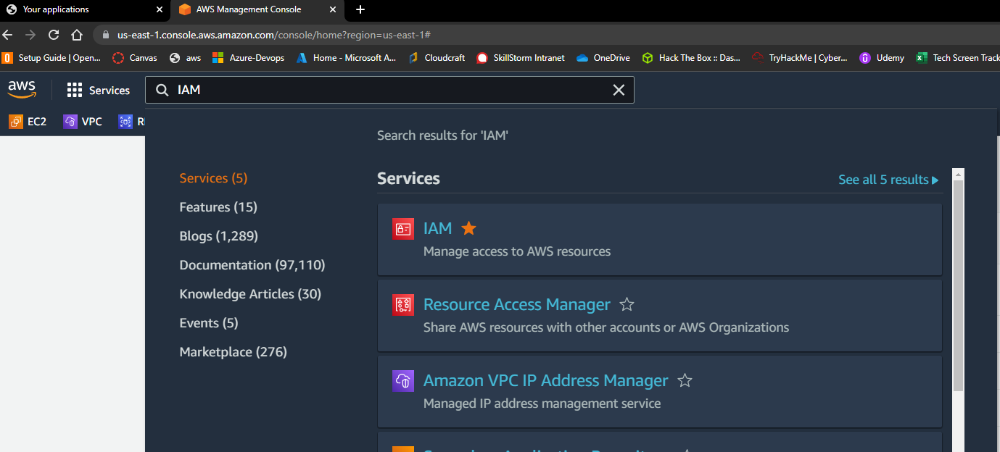
>
>You should be taken to the EC2 dashboard pictured below
>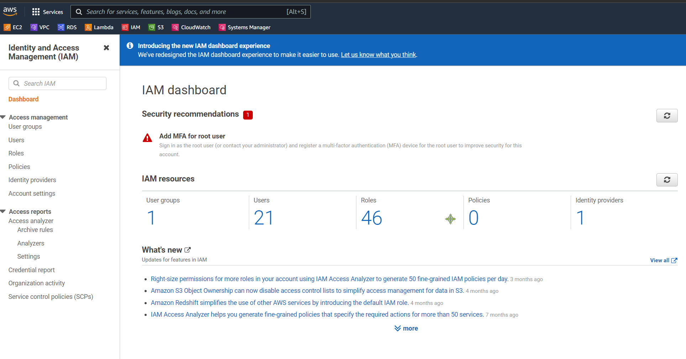
>Click ***Users*** in the center dashboard or left navigation blade
>
>
>
>***Step 1:*** Click ***Add user***
>
>***Step 2:*** create a username
>
>***Step 3:*** select access key and password blocks
>
>***Step 4:*** create a unique password
>
>***Step 5:*** uncheck require password reset (you can keep this checked if you want the user change their password after user creation.  Having them change their initial password is considered best practice)
>
>***Step 6:*** The rest of the settings will remain default
>
>***Step 7:*** Click on the user, copy and save the ARN.  We will use that later on. 
>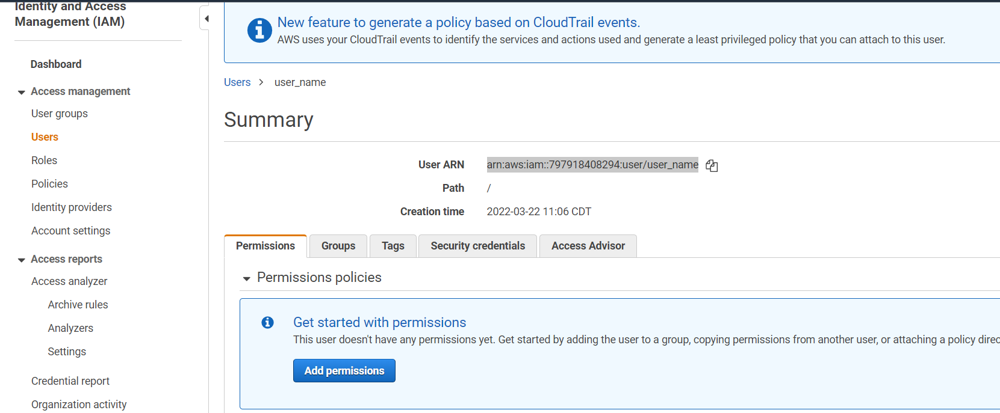
---
## Part 2: Create your role
>***Step 1*** Select **Roles** on the IAM Dashboard
>
>***Step 2:*** Select **Create Role** button on the upper right of the roles screen as seen below: 
>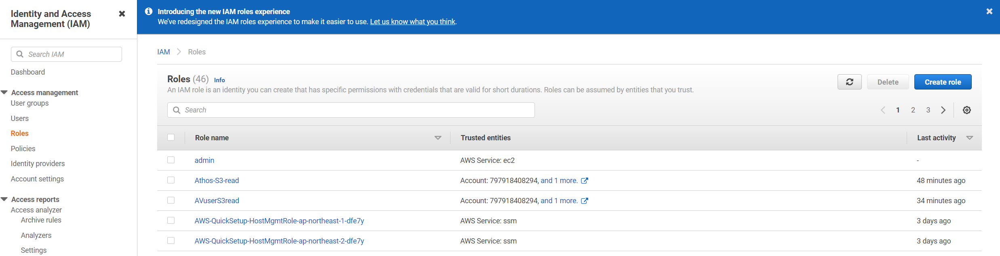
>
>***Step 3:*** >
>Select the following box:
>
>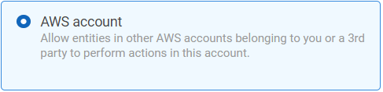
>On the Create Roles page below:
>
>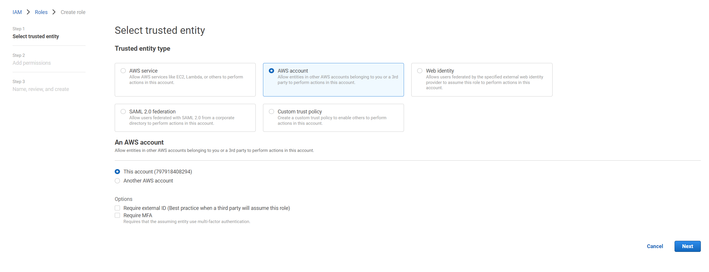
>
>***Step 4:*** select next and search for **AmazonS3ReadOnlyAccess**
>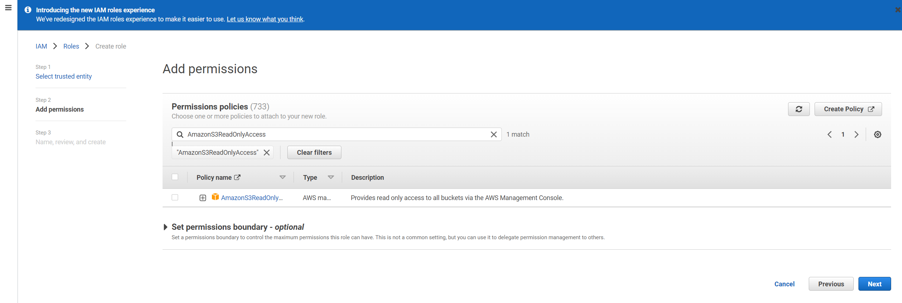
>select next
>
>***Step 5:*** Create a unique role name for your role then click **Create Role**
---
## Part 3: Assume role
>***Step 1:*** select the role you just created
>
>***Step 2:*** Slect the **Trust Relationships** tab
>
>***Step 3:*** Select **Edit Trust Policy**
>
>***Step 4:*** place the ARN of your user in the JSON script like it is below:
>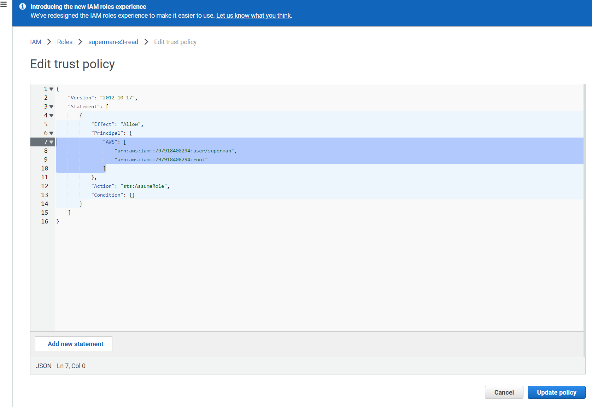
>
>***Step 5:*** Finally sign in as the user you just created in an incognito window of your browser.  Use **vet-tec** as the account alias.
> 
>***Step 6:*** click the user at the top right of your AWS account
>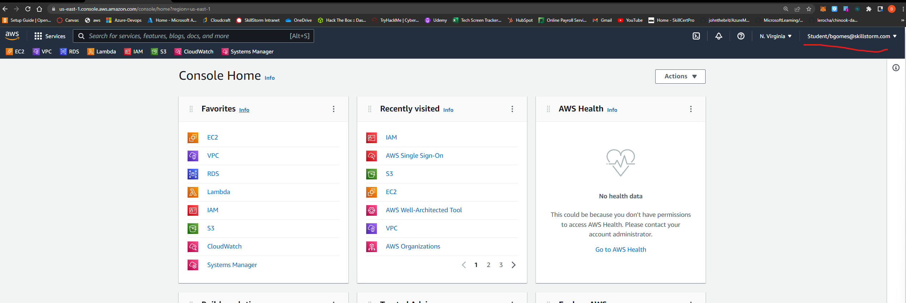 
>
>***Step 7:*** Copy the **Account ID** then Select **Switch role**
>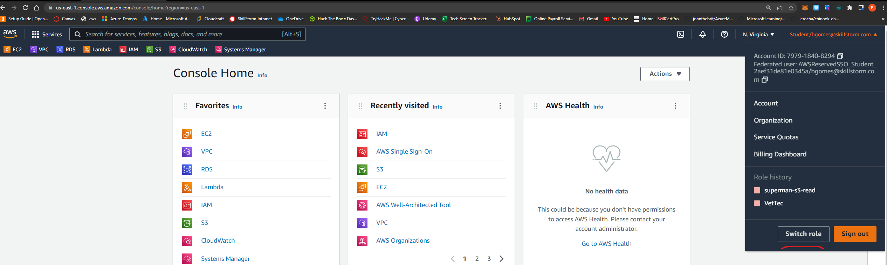
>
>On the next page you will add the account ID, Role name and the display name.  
>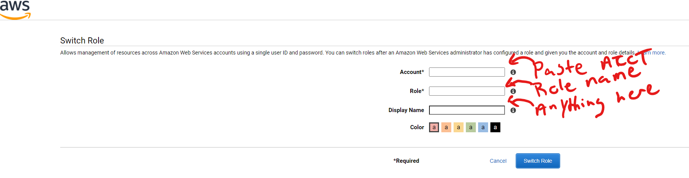
>***Step 8:*** select switch role then navigate to S3 and see if you can read the buckets. 