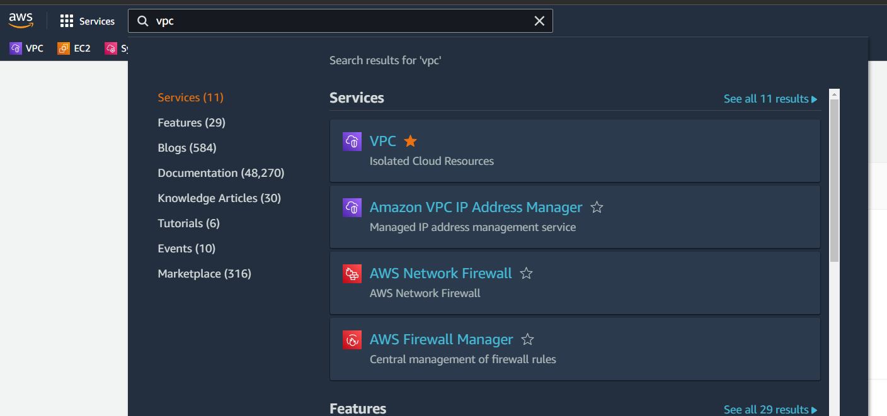
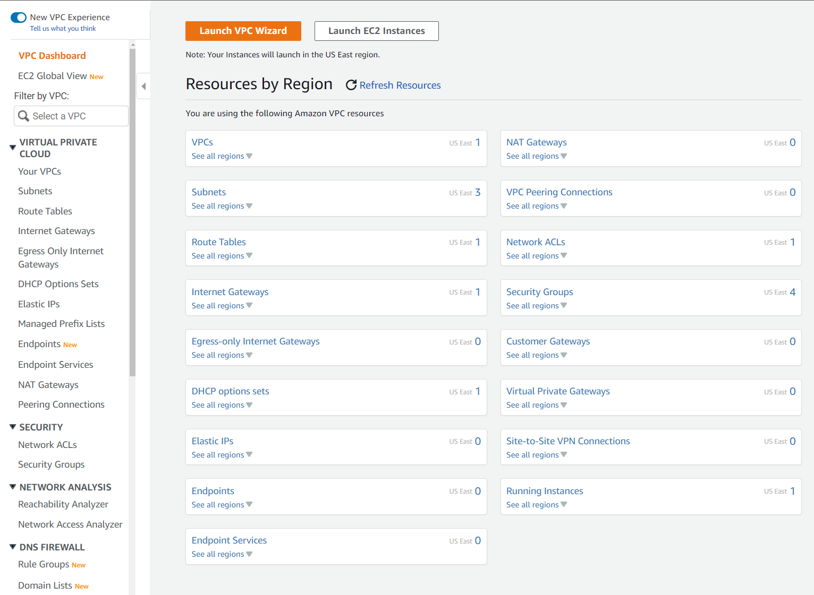
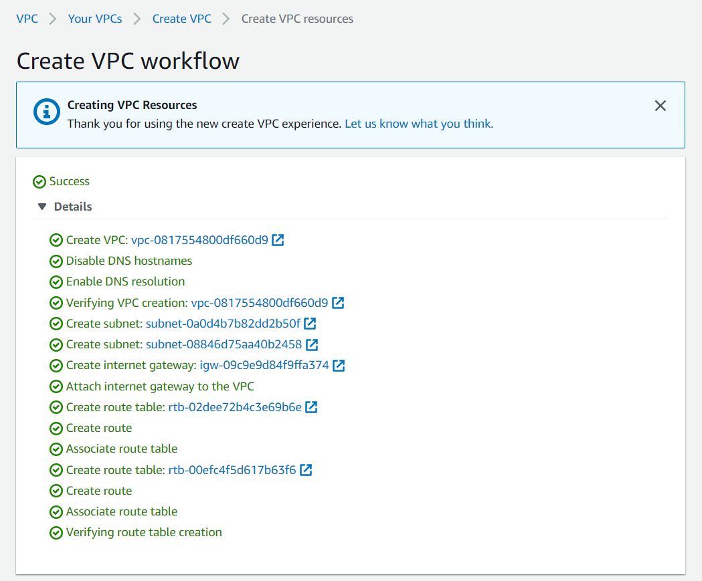
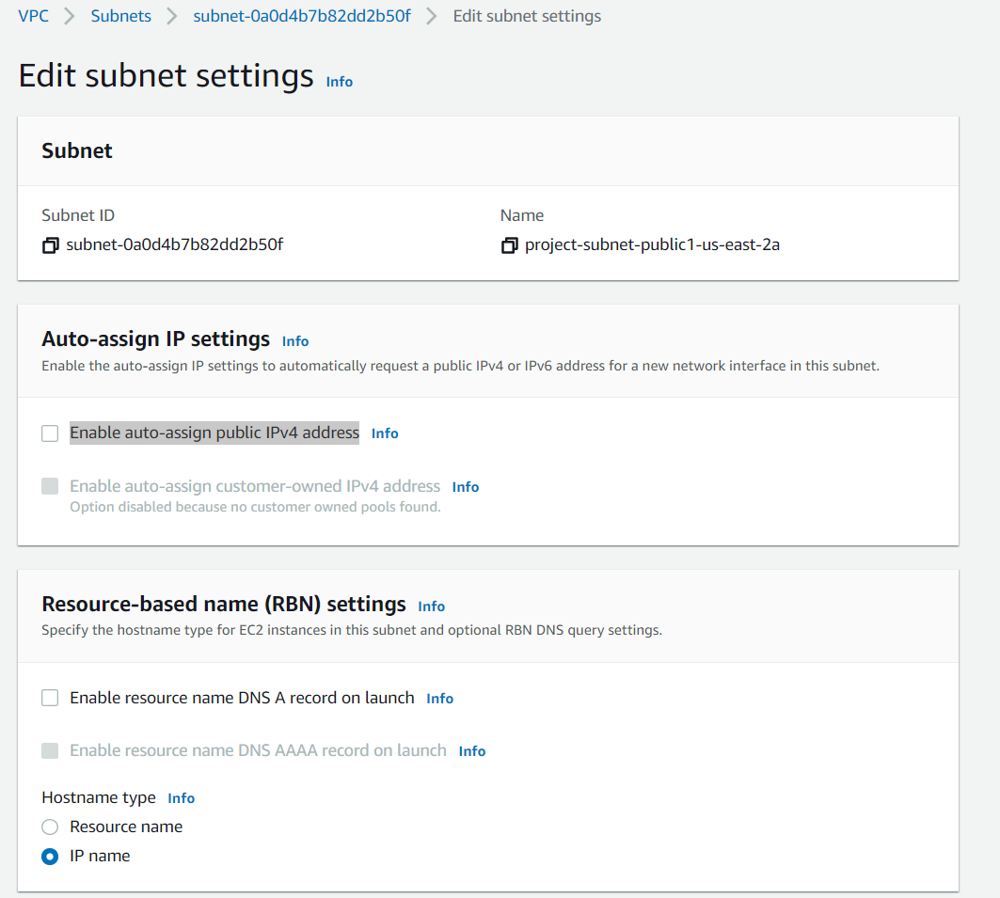

# Create VPC
---
## Part 1: Go to the VPC Wizard
---
>***Open the AWS console at [aws.amazon.com](https://aws.amazon.com/)***
>
>Select VPC from the search bar after you log in. 
>
>
>
>You should be taken to the VPC dashboard pictured below
>
>>
***From here you have 2 options to create a VPC.  You can select VPCs in the dashboard or you can launch the VPC Wizard at the top.  For this lab we will be using the wizard.***

>
>
Select Launch Wizard and you will be taken to the screen below:

>
>
>From here we make our VPC selections
>
>**Step 1:** Select VPC, subnets, etc.
>
>**Step 2:** Keep tag autogenerate block checked
>
>**Step 3:** Select your CIDR block range (VPC cannot have a CIDR range larger than /16)
>
>**Step 4:** Select the number of AZs you would like to use
>
>**Step 5:** You can select public and private subnets, for the purposes of this lab we will make sure we have at least 1 public subnet. 
>
>**Step 6:** VPC endpoints, select none
>
>**Step 7:** create VPC
>
>***You should see something like the below image after you create your VPC***
>
>Select **View VPC** on the bottom of the above page
>
>Finally select subnets on the left hand side and find your public subnets
>
>click the checkbox next to one of your public subnets and select actions at the top right then select edit subnet settings
>
>You will enable public IPv4 address here by checking the box next to "Enable auto-assign public IPv4 address" and save your settings
>
---
# You now have a custom VPC that allows public internet traffic.
---
# Ensure to clean up your environments. 