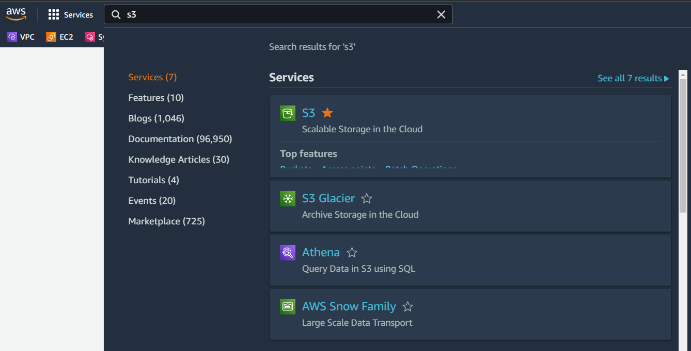
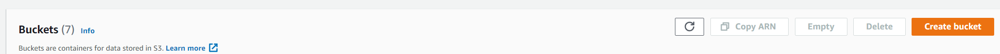
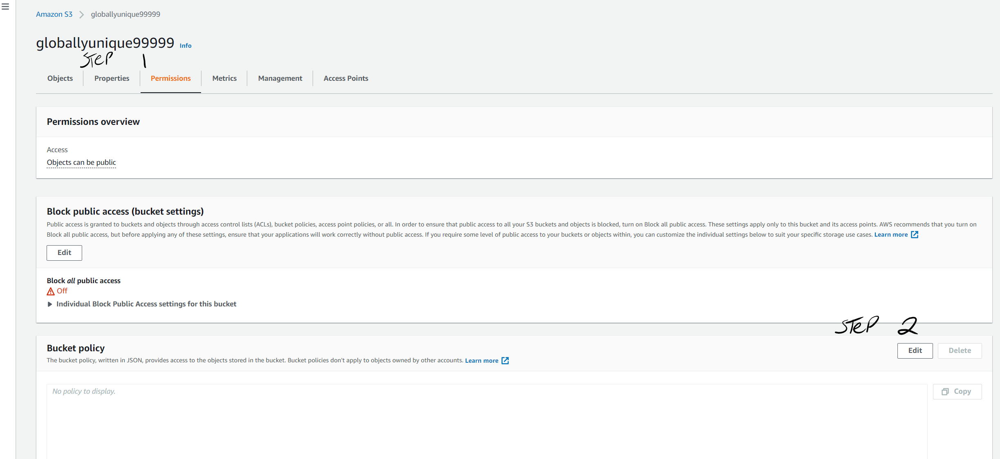
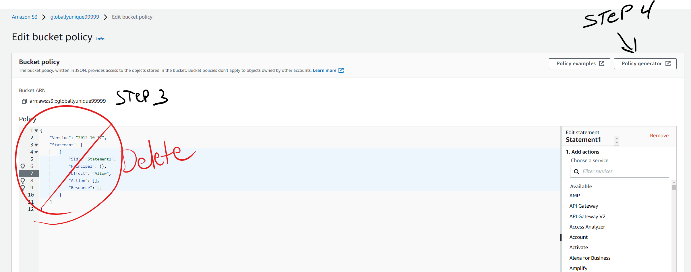

# S3 Static Website Demo
---
## Part 1: Create your instance
---
>***Open the AWS console at [aws.amazon.con](https://aws.amazon.com/)***
>
>Select S3 from the search bar after you log in. 
>

>Select **Create Bucket**
>

>
>Part 1: Create your Bucket 
>
>>***The bucket name must be a globally unique name***
>>
>>Object Ownership will have disabled ACLs by default.  This will require us to make S3 resource policies to allow public access to our buckets. 
>>
>>Block Public Access is enabled by default.  We will uncheck that box and allow public access
>>
>>We will enable bucket versioning
>>
>>The remaining settings on this page will be default settings. 

---
## Part 2: Upload your First File
>Before we begin, make sure to click this [***link***](https://drive.google.com/uc?export=download&id=1xSwlSNYvF9GunT_0hvXj-hNiBlqlXAKV) to download the index.html file for this lab. 
>
>****Step 1:**** Select the bucket you just created
>
>****Step 2:**** Select upload
>
>****Step 3:**** select add files
>
>****Step 4:**** find the index.html file you just downloaded and upload it to your bucket. 

---
---
## Part 3: Provide public access to your bucket through policy
### ***You will need your bucket ARN for this step.  You find it under properties tab for your selected bucket. ***
>**Step 1:** On your bucket tabs select permissions
>
>**Step 2:** scroll down to bucket policy and select edit

>**Step 3:** Delete the policy that is in the policy block
>
>**Step 4:** Select Policy Generator.

>>In the policy generator follow these steps
>>>**Step 1:** Select Type of Policy - S3 Bucket Policy
>>>
>>>**Step 2:** Effect - Allow
>>>
>>>**Step 3:** Principal - * (* = wildcard and is used to allow all principals access to the bucket.)
>>>
>>>**Step 4:** We select all actions next to the drop down box.
>>>
>>>**Step 5:** Add the ARN for your bucket.
>>>
>>>**Step 6:** click Add Statement
>>>
>>>**Step 7:** Repeat these steps but when you get to step 5, ensure to add a /* at the end of the ARN to allow permission to the files within the bucket as well. 
>
>You now have a publicly accessible bucket and index.html file.

---
## Part 4: Enable static website hosting.
>****Step 1:**** In your bucket select properties.
>
>**Step 2:** Scroll all the way down until you see static website hosting
>
>**Step 3:** click edit then enable static website hosting
>
>**Step 4:** put in the name of your website homepage in the index document block(in our case it is index.html) 
>
>**Step 5:** Save changes and scroll all the way back down, you will have a URL to access your website via http

