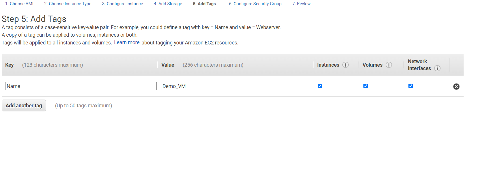

# Connect to EC2
---
## Part 1: Create your instance
---
>***Open the AWS console at [aws.amazon.com](https://aws.amazon.com/)***
>
>Select EC2 from the search bar after you log in. 
>
>
>
>You should be taken to the EC2 dashboard pictured below
>
>Click Launch instance and select the launch instance option
>
>**Step 1:** Choose your Amazon Machine Image
> 
>>***You can choose from the quick start guide, your own custom img, marketplace img, or community created img.***  
>
>For purposes of this lab, choose a free tier image.  I will select an ubuntu image shown below. 
> 
> **Step 2:** Choose the instance type - t2.micro
> 
> **Step 3:** Configure instance details. For purposes of this lab we will keep all of these settings as default. 
> 
> **Step 4:** keep default storage options
> 
> **Step 5:** You can add tags to the VM
> 
>**Step 6:** Add security group with ports 22 and 80 open.  
> 
>***click review and launch at the bottom right of your screen***
>
>***Ensure all of the settings are as expected then click launch.***
>
>***Once you click launch you will be prompted for an SSH key*** 
>
>***You can either create and download a new key or use an existing key.*** 

>
## Part 2: Connect to your instance

>**Step 1:** Go to the EC2 Dashboard and select instances(running) link and choose the box next to your instance. click connect to see connection options and choose the ssh client

>
>Once on that page, you can see the instructions that you need to follow to connect to your machine via SSH.  

>>***You may need to change permissions on your key using chmod 400 <key_name>***
>
>**See Below**

># Now you are connected to an EC2 instance!!

# Make sure to clean up your infrastructure

